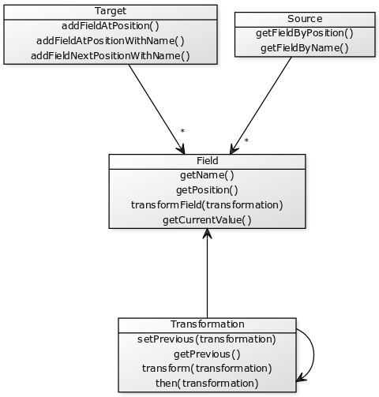

# csv-importer

This project is about reading data from sources (API, XML, CSV, etc), select some fields, transform them, 
and save the result in a data target (API, XML, CSV, etc).

In this first version we are keeping just the CSV as input and output but trying to keep the project ready to
the others data types.

To read a CSV File you need to set the settings and then the project will load the fields of the data source:



```php
$objSettings = CsvSourceSettings::builder()->
  withColumnDelimiter(";")->
  withFileName("input.csv")->build();
$objCsvSource = new CsvSource($objSettings);
```

After that, there are different options of getting the fields of that data source

```php
$objCsvSource->getFieldByName("Name")
$objCsvSource->getFieldByPosition(0)
```

After selecting the fields, we can transform them. While some transformations don't required any kind of paramter, 
others demand some attributes. The calls of transformations can be call on chain using two different strategies:

```php
# field is changed and create a new field that can also be changed...
$objCsvSource->getFieldByName("Name")->transformField(
  new UpperCaseTransformation()
)->transformField(
  new CamelCaseTransformation()
);
# Transformation can add a new step creating a more complex transformation  
$objCsvSource->getFieldByName("Name")->transformField(
  new UpperCaseTransformation()->then(
    new CamelCaseTransformation()
  )->then(
    new RecodeTransformation()
  )->add("Yes",1)->add("No",0)
)
```
  
The fields are immutable, so every new transformation create a new field. In that sense, if one field was created based on
a previous, both can be used.

```php
$objFieldName = $objCsvSource->getFieldByName("Name");
$objFieldHash = $objFieldName->transformField( new HashTransformation() );
$objCsvTarget = new CsvTarget();
$objCsvTarget->
  addFieldNextPositionWithName($objFieldName,"name")->
  addFieldNextPositionWithName($objFieldHash,"hash")->
  getCsvContent()
```

On the CsvTarget, the fields do not need to be created on the output order.

```php
$objCsvTarget->
  addFieldAtPositionWithName(2,$objFieldName,"name")->
  addFieldAtPositionWithName(1,$objFieldHash,"hash")->
  getCsvContent()
```

All the field transformations are definitions related to fields. So, only when the target is reder, that reading the source file just one time, line by line, we make all the transformations required only for the fields necessary to the target and without creating new objects.

## Classes and Interfaces

All the classes used on this project are on the Importer folder [app/Importer](app/Importer)

## Tests and Examples

All the tests used on this project are on the Unit Test folder [tests/Unit](tests/Unit)

## To Do

* The CLI command to read a csv file and apply the transformations
* The Web Interface to list the fields on a file and let the user create the output selecting the fields and adding the transformations
